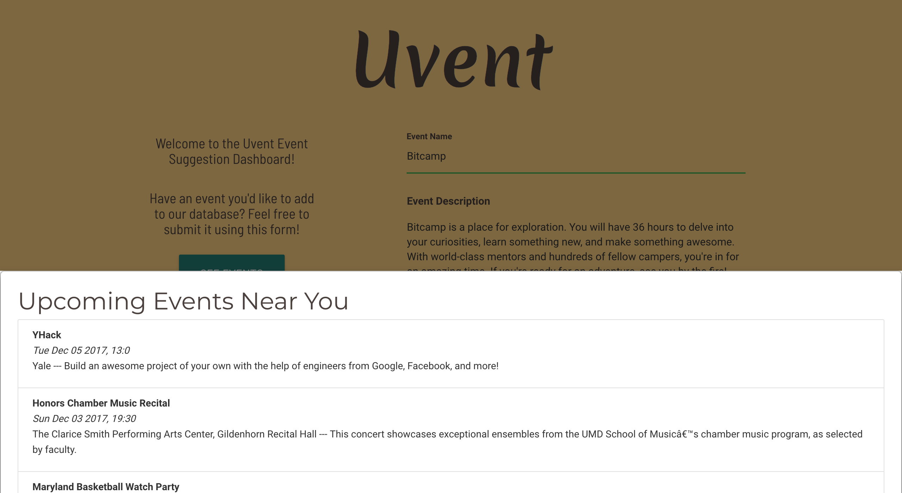
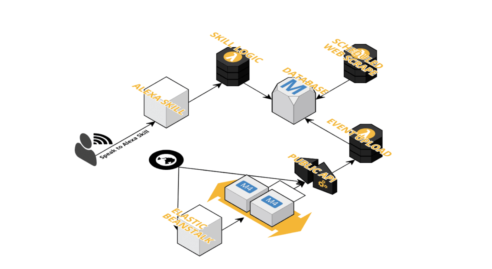

# Uvent
Uvent is an automatically updating service which helps users find nearby events. Users can use Amazon Alexa to discover interesting events going around on campus (currently available for UMD). Each morning, Uvent scrapes datasets and calendars to load new event information. This information is available through the Alexa skill, our frontend website, and our public API. Users can also submit events to our database through our website or through POST requests.





## Deliverables
[Project Proposal](https://github.com/timothychen01/uvent/blob/master/deliverables/CMSC389L%20Final%20Project%20Proposal.pdf)

[Checkpoint Document](https://github.com/timothychen01/uvent/blob/master/deliverables/CMSC389L%20Final%20Project%20Checkpoint.pdf)

[Demo Video](https://www.youtube.com/watch?v=uM8DYldtCOQ)


## AWS Services Used
Lambda, DynamoDB, API Gateway, Elastic Beanstalk, Alexa Skills Kit


## Inspiration
One of the greatest truisms in the entrepreneurship space is that no one wants an events app - and we concur. People prefer asking their friends!

Example:

> “Hey, Tim! What are you doing tonight?”

But if you’re a CS/EECS/CE kid without friends, you can ask the next best thing - Alexa from the 5th Echo Dot you’ve won at a hackathon! With that we present Uvent, the premier Alexa skill for discovering events around you.

Example:

> “Hey Alexa! Ask Uvent what’s going on this weekend?”

Finally, you can get some use out of your Echo Dots!


## Architecture



## Components
#### Amazon Alexa Interface
Users can ask Uvent via Amazon Alexa what events are nearby!

#### Background processes
Each morning, Uvent will automatically update our event database with any new postings from the datasets we're following.

#### Frontend web interface
We also built a web interface (you can also use it on mobile) for users to submit events they know about as well as scroll through our database of events.

#### Publicly exposed API
We want everyone to experiment with event data, so we've exposed our APIs for anyone to play around with. We've done the hard work of cleaning up the data - you just have to come up with a cool idea!

## How we built it
- Alexa Skill Kit
- DynamoDB: stores event data
- API Gateway: exposes a public API to upload and get events
- AWS Lambda: Node.js functions to interface with DynamoDB and expose to API Gateway, scheduling daily web scraping (with Cloudwatch), Alexa Skill logic
- Elastic Beanstalk: hosts the website (we created a Node/Express server because why not)
- Materialize CSS

## Challenges we ran into
With any date/time based project, there's a lot of converting between different formats, time zones, etc... which quickly gets frustrating. That took some time to get hashed out, but eventually we got it.

## What we learned
Our goal with this project was to use as much of AWS as possible, and I think we’ve definitely learned a ton. Reading and learning about AWS or any tech isn’t the same as actually using it in a project, so this really opened up our eyes in terms of how to configure our services and what the applications of each are.

## What's next for Uvent
We’re initially launching Uvent for events near the University of Maryland, College Park. Because of our familiarity with event datasets in our area, that's what we're starting out with. In the future, we plan to expand nationwide, covering as many college campuses as possible (and even further after that)!

Ultimately, we want Uvent to tailor events based on every user's interests. As the user uses the skill more, they will receive more events that are filtered for their preferences. When someone asks Alexa for event suggestions, it will list out the events that are most relevant.


# Technical Documentation

## Public API

#### POST `/events`
```
{
  "operation": "create",
  "payload": {
    "Item": {
      "name": "Bitcamp",
      "description": "Bitcamp is a place for exploration. We're a hackathon that values participant experience and mentorship over competitiveness and points. Come to have fun with your friends, learn something new, eat s'mores, and have a generally awesome time. We have all sorts of crazy activities planned for you...you'll have to come to find out the rest!",
      "location" : "Xfinity Center",
      "startDate": "2018-04-06T17:00:00Z",
      "endDate": "2018-04-08T15:00:00Z",
      "categories": [
        "Competition",
        "Hackathon",
        "Multiday",
        "Technology"
      ]
    }
  }
}
```

#### GET `/events?begin=[beginDateTime]&end=[endDateTime]`

```
var startStr = "2018-04-03T00:00:00Z";
var endStr = "2018-04-10T00:00:00Z";
var url = "/path/to/our/url/" + startStr + "&end=" + endStr;

$.get(url, function(res, status) {
  for(var i = 0; i < res['Items'].length; i++) {
    const e = res['Items'][i];
    console.log(e['Name']); // Print out each event name
  }
});
```

## DB Schema

#### Events
```
{
	eventID:integer,
	name:string,
  description:string,
  location:string,
	startDate:Date, //format: `date "+%Y-%m-%dT%H:%M:%SZ"`
	endDate:Date,
	categories:[string],
	creationDate:Date
}
```

#### User
```
{
	alexaId,
	eventHistory:[Event uid],
	categoryWeights:{
		category:weight
  }
}
```

## Branding

#### Fonts
- Logo: Merienda One
- Main Text: Montserrat, Barlow Semi Condensed


#### Color Scheme

